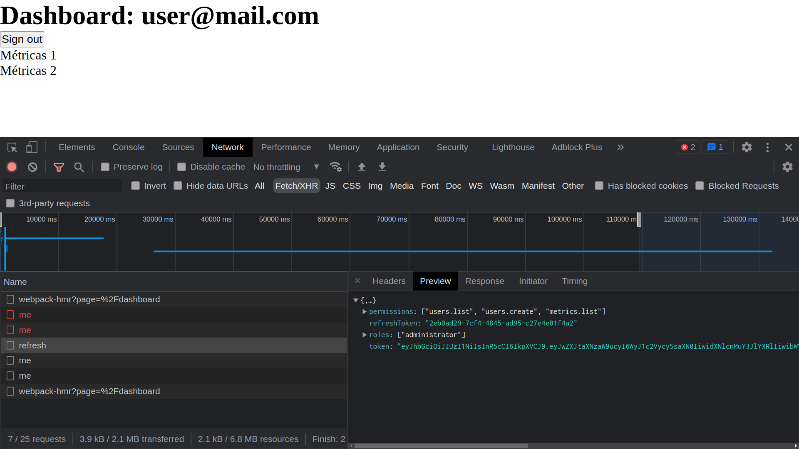

<h1 align="center">
  NextAuth
</h1>

<p align="center">
  
       
  
</p>

# Ignite Project
NextAuth is an application that handles authentication and authorization using Next.js and Node.js to create the backend.

## Refresh token in action
<p align="center">
  
</p>

## Configure user, permissions and roles
File path: `server/src/database.ts`

There are already two users to test, you can add, update or delete these users in the **seedUserStore** function.

## Configure token expiration time
File path: `server/src/auth.ts`

Change the `expiresIn` property in the **generateJwtAndRefreshToken** function expressed in seconds or a string describing a time span zeit/ms. Eg: 60, "2 days", "10h", "7d".

Adjust this time to a small value to be able to quickly test the refresh token.

## 🚀 Techs
→ [**Next.js**](https://nextjs.org)

→ [**TypeScript**](https://www.typescriptlang.org)

→ [**Axios**](https://github.com/axios/axios)

## 💻 Run project
```bash
# Open terminal and clone this repository
$ git clone https://github.com/Sup3r-Us3r/ignite-project-nextauth.git

# Install dependencies for the server
$ cd ignite-project-nextauth/server
$ npm install
# or
$ yarn install

# Start the server
$ npm run dev
# or
$ yarn dev

# Install dependencies for the app
$ cd ignite-project-nextauth/web
$ npm install
# or
$ yarn install

# Start the application
$ npm run dev
# or
$ yarn dev
```